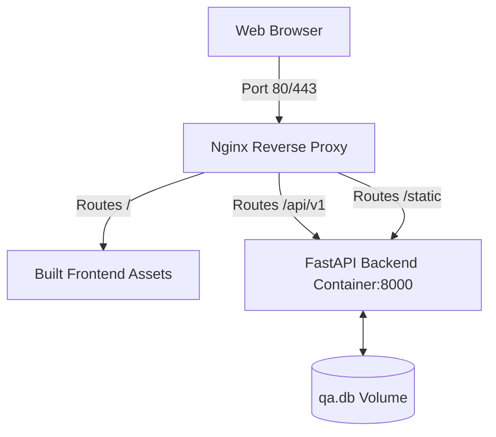

# 🐳 Docker Deployment & Containerization Guide

This guide explains how to build, orchestrate, and run the **Obsidian Software QA & Defect Tracking Platform** in containerized environments using **Docker**, **Docker Compose**, and **Nginx**.

---

## 📐 Architecture Overview

The containerized stack is designed around a **Single-Port Reverse Proxy Architecture**. Instead of running the React client and FastAPI server on separate ports (which introduces CORS policies and complex domain configurations), Nginx acts as a unified gateway.



### Component Details
1. **Frontend Container (`Dockerfile` / Root)**: Uses a multi-stage Docker build.
   * **Build Stage**: Uses Node.js 20 to install dependencies (`npm ci`) and compile the Vite React app into static HTML/JS/CSS assets (`/dist`).
   * **Runner Stage**: A minimal Nginx container that hosts the static assets and routes reverse proxy traffic.
2. **Nginx Router (`nginx.conf`)**: Configured to serve the SPA static assets and proxy all requests beginning with `/api/v1` and `/static` to the backend Python container on port `8000`.
3. **Backend Container (`backend/Dockerfile`)**: A lightweight Python 3.11 container running Uvicorn to serve the FastAPI REST API, handling relational schema creation, multipart uploads, and activity auditing.
4. **Docker Compose (`docker-compose.yml`)**: Coordinates container creation, handles environment variable injection, and provisions persistent volumes.

---

## ⚡ Quick Start Command Reference

### 1. Build and Start the Stack
Run the following command from the repository root directory to build images and launch the containers in detached (background) mode:
```bash
docker-compose up --build -d
```
* **Frontend/Proxy Interface**: accessible at [http://localhost](http://localhost)
* **Interactive Swagger API Docs**: accessible at [http://localhost/docs](http://localhost/docs)

### 2. Relational Database Seeding
The database tables are automatically created on container startup. To seed the database with mock software projects, bugs, and team credentials, execute `seed.py` within the running backend container:
```bash
docker-compose exec backend python seed.py
```

### 3. Review Running Container Logs
Follow live stdout/stderr streams from both the frontend and backend:
```bash
docker-compose logs -f
```
Or view logs for a single service:
```bash
docker-compose logs -f backend
```

### 4. Halt and Tear Down the Containers
To stop and remove containers while **preserving** database volumes:
```bash
docker-compose down
```
To stop containers and **completely wipe** all persistent database and upload volumes:
```bash
docker-compose down -v
```

---

## ⚙️ Environment Configuration

Configuration variables are injected directly into the backend container through the `docker-compose.yml` file:

| Variable | Default Value | Description |
| :--- | :--- | :--- |
| `DATABASE_URL` | `sqlite:///./qa.db` | Connection string. Can be swapped easily for a PostgreSQL instance. |
| `JWT_SECRET` | `qa_platform_production_secure_key_change_me_in_prod` | Signing secret for JSON Web Token user claims. Change this to a secure random hash in production. |
| `UPLOAD_DIR` | `static/uploads` | Path on container disk where uploaded screenshots and files are stored. |
| `CORS_ORIGINS` | `["*"]` | Cross-Origin configuration. Set to `["*"]` because Nginx handles reverse proxy routing, eliminating standard CORS issues. |

---

## 💾 Persistent Volumes

To prevent data loss when containers are restarted or rebuilt, Docker Compose provisions two named persistent volumes:
* `sqlite-data`: Mounts to `/app` inside the backend container to persist the SQLite `qa.db` database.
* `uploads-data`: Mounts to `/app/static/uploads` inside the backend container to persist pasted clipboard screenshots and attachments.

---

## 🛡️ Production checklist

Before deploying this stack to a public cloud environment (e.g., AWS, GCP, Azure, DigitalOcean):
1. **Change JWT Secret**: Always update the `JWT_SECRET` key to a secure, randomly generated string in your production environment.
2. **Swap SQLite for PostgreSQL**: For large-scale production workloads, append a database service to your `docker-compose.yml` and modify the backend `DATABASE_URL`:
   ```yaml
   # Example snippet for PostgreSQL integration
   services:
     db:
       image: postgres:15-alpine
       environment:
         POSTGRES_DB: qa_db
         POSTGRES_USER: qa_admin
         POSTGRES_PASSWORD: secure_database_password_123
       volumes:
         - pgdata:/var/lib/postgresql/data
     backend:
       ...
       environment:
         - DATABASE_URL=postgresql://qa_admin:secure_database_password_123@db:5432/qa_db
   ```
3. **Configure SSL/TLS (HTTPS)**: Set up an SSL certificate (e.g., Let's Encrypt Certbot) and configure Nginx to listen on port `443` with appropriate certificate paths.
