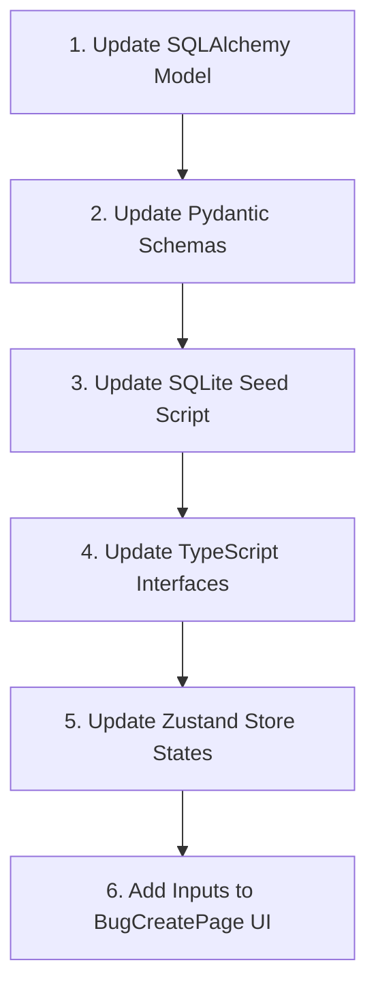

# 🤖 AI Agent Engineering Manual — Software QA Tracker

Welcome, AI Coding Agent! This document is designed to provide you with high-context system guidelines, codebase constraints, relational models mapping, design rules, and step-by-step recipes for safely editing and extending this codebase.

---

## 🎯 Codebase Mission & Identity

This platform is a premium **IT Sector Bug and Defect Tracking System** designed with a modern **Glassmorphism UI** (inspired by VS Code Dark Modern theme guidelines). It completely replaces simple forms with highly functional split-screen bug creation, clipboard screenshot uploader panels, system notifications, and a fully structured Python FastAPI backend database.

### 🚫 ZERO INDUSTRIAL TERMINOLOGY RULE
Do not use hardware/machinery/factory concepts (e.g., "machines", "operators", "parts", "production line"). All terms are fully mapped to IT systems:
* **Machine** ➡️ **System Platform** (`web`, `ios`, `android`, etc.)
* **Operator** ➡️ **Tester / QA Submitter**
* **Part Number** ➡️ **Affected Version** / **App Version**
* **Factory Floor** ➡️ **Environment** (`production`, `staging`, `testing`)

---

## 📂 Core Folder & File Directory Map

Here is where critical codebase components reside. Ensure you respect this architecture when creating or editing files.

```
/
├── backend/                        # FastAPI Backend Application
│   ├── app/
│   │   ├── routes/                 # Endpoint routers (auth, bugs, projects, attachments)
│   │   ├── auth.py                 # JWT & bcrypt security handlers
│   │   ├── config.py               # Database settings and environment variables
│   │   ├── database.py             # Session connection engine (get_db dependency)
│   │   ├── models.py               # SQLAlchemy ORM relational models
│   │   ├── schemas.py              # Pydantic V2 schema validations
│   │   └── storage.py              # Unique UUID attachment filesystem operations
│   ├── main.py                     # App entry point & static mounts
│   ├── seed.py                     # Database relational populator script
│   ├── requirements.txt            # Python server library dependencies
│   └── api_tests.http              # Complete 10+ edge case REST integration tests
│
├── docs/                           # Human-Agent Documentation Repository
│   ├── api_endpoints.md            # JSON API Request/Response specifications
│   ├── architecture.md             # Systems blueprints, pipeline flows, & ERD
│   ├── getting_started.md          # One-click start, environment variables, & mock profiles
│   └── agent_instructions.md       # (This file) Rules & coding practices for AI Agents
│
└── src/                            # React Client Application
    ├── components/
    │   ├── bugs/                   # Attachment uploader, zoom lightbox, filters
    │   ├── layout/                 # Sidebar, AppShell, User status cards
    │   └── ui/                     # Premium glass widgets, select dropdowns, tags
    ├── pages/                      # Linear-style creation, dashboards, detail queues
    ├── stores/                     # Zustand state pools (bugStore, userStore, uiStore)
    ├── types/                      # Comprehensive TypeScript schemas
    ├── utils/                      # Date compilers, unique ID generators
    ├── index.css                   # Obsidian VS-Code variable definitions & animations
    └── main.tsx                    # React SPA mounting root
```

---

## 🎨 Premium Visual Theme Standards (Obsidian VS-Code Glassmorphism)

This application uses a premium CSS variable system designed to emulate the **VS Code Dark Modern** theme in dark mode and a beautiful light slate-cream aesthetic in light mode.

> [!IMPORTANT]
> When styling new pages or components, **NEVER** use raw background colors or harsh standard Tailwind utility values (like `bg-red-500` or `bg-white`). Always write components that leverage our harmonized, glassmorphism theme variables.

### Key CSS Variable Tokens (`src/index.css`)
* **Background Obsidian Glass**: `--bg-app` (deep graphite slate) or `--bg-card` (semi-transparent glass card).
* **Borders**: `--border-glass` (delicate translucent borders).
* **Text Harmonizers**: `--text-primary` and `--text-secondary` (soft silver-grays).
* **Brand Highlights**: `--brand-accent` (VS Code vibrant blue or specific user-defined hexadecimal accent colors).

### CSS Styling Guidelines for Agents:
1. **Dynamic Dark Classes**: Use Tailwind's `dark:` modifier to adjust borders and text.
2. **Glassmorphism Backdrop Filters**: Combine `.backdrop-blur-md` and `bg-opacity-40` with `--border-glass` to achieve premium glossy plates.
3. **Hover Micro-Animations**: Give buttons, cards, and lists a slight scale, translate, or border shine when hovered (`transition-all duration-300 hover:scale-[1.01] hover:border-brand-accent`).

---

## 🔒 The Three Golden Engineering Laws

### Law 1: Stale Closure Prevention in Copy-Paste Uploader
The browser clipboard paste pipeline inside `src/components/bugs/AttachmentUploader.tsx` uses standard keyboard event handlers.
* **Why**: The sandboxed `navigator.clipboard.read()` API is blocked in non-secure HTTP contexts or background states. We intercept clipboard uploads via the standard window `paste` event.
* **AI Rule**: When writing or updating paste handlers, **always** store react state parameters (like upload lists or configuration objects) inside a React `useRef` before passing them to the listener handler. Registering a standard state hook variable inside a global event listener creates **stale lexical closures**, dropping uploaded screenshots or throwing state errors.

### Law 2: Relational Model Integrity (Frontend ↔ Backend Mapping)
Any database field added to the backend models (`backend/app/models.py`) must be correctly mapped to:
1. **Pydantic Validation Schemas** (`backend/app/schemas.py`) — with custom validators where appropriate.
2. **Zustand Frontend Store Interfaces** (`src/types/index.ts` and `src/stores/bugStore.ts`).
3. **Seeding Script** (`backend/seed.py`) — ensuring mock datasets populate the database with correct foreign-key relationships.

### Law 3: Desktop System Notifications Permission
Desktop notices utilize the HTML5 `Notification` browser standard.
* **Permission Request**: Triggered automatically inside `AppShell.tsx` during application mount.
* **Assignment Hook**: Hooked directly inside the Zustand `bugStore.ts` under mutations like `createBug` or `assignBug`. If notification permission is `'granted'`, fire a slide-in system toast. Do not pollute components with direct notification constructors.

---

## 🛠️ Step-by-Step Developer Recipes for AI Agents

### Recipe A: Adding a New Field to a Defect Ticket
If you need to add a new parameter (e.g., `regression_risk` or `hotfix_eligible`) to a bug ticket:



#### Step 1: Backend Model Extension (`backend/app/models.py`)
Add the database column using standard SQLAlchemy types:
```python
regression_risk = Column(String, default="low") # low / medium / high
```

#### Step 2: Schema Validation (`backend/app/schemas.py`)
Add the corresponding variable to `BugCreate`, `BugUpdate`, and `BugResponse` classes:
```python
regression_risk: Optional[str] = "low"
```

#### Step 3: Relational Seeder Script (`backend/seed.py`)
Include standard data for existing seeded bugs so tests compile correctly:
```python
regression_risk="low"
```

#### Step 4: Frontend Types Integration (`src/types/index.ts`)
Update the typescript `Bug` interface:
```typescript
regressionRisk?: 'low' | 'medium' | 'high';
```

#### Step 5: Zustand Store Sync (`src/stores/bugStore.ts`)
If parsing backend API models to local client states, ensure the camelCase serializer handles the new column:
```typescript
regressionRisk: bug.regression_risk || 'low'
```

#### Step 6: Split-Screen Creation UI (`src/pages/BugCreatePage.tsx`)
Incorporate the dynamic input dropdown within the appropriate card sidebar or actual/expected side panel:
```tsx
<select 
  value={formData.regressionRisk} 
  onChange={(e) => setFormData({...formData, regressionRisk: e.target.value})}
  className="w-full bg-glass border border-glass rounded p-2 text-primary focus:border-brand"
>
  <option value="low">Low Risk</option>
  <option value="medium">Medium Risk</option>
  <option value="high">High Risk</option>
</select>
```

---

### Recipe B: Performing Database Wipes and Relational Seeding
When you edit models, the active SQLite file (`backend/qa.db`) needs to compile with clean schemas. Follow these terminal steps:

1. Terminate any running FastAPI development servers.
2. Delete the physical SQLite file safely:
   * **Windows Terminal**:
     ```powershell
     Remove-Item -Path "backend/qa.db" -ErrorAction Ignore
     ```
   * **macOS / Linux**:
     ```bash
     rm -f backend/qa.db
     ```
3. Run the Python seeder script:
   ```bash
   cd backend
   python seed.py
   ```
4. Confirm successful seeding output before restarting the development server.

---

### Recipe C: Integration Testing via `.http` File
This repository includes a professional-grade `.http` REST test file (`backend/api_tests.http`). You can run it inside editors like VS Code (with REST Client extension) or standard command-line tools like `httpyac`.

Always run the full suite after making API route edits to ensure:
* JWT Tokens generate correctly.
* Multipart upload file sizes do not raise exceptions.
* Foreign keys do not block database writes.
* Validation layers filter improper inputs.

---

## 🚦 System Debugging & Logs Cheatsheet

* **FastAPI Server Logs**: Keep an eye on terminal stdout for tracebacks. Most validation errors raise `422 Unprocessable Entity` due to missing properties inside custom schemas.
* **Inspect Local Storage uploads**: Uploaded attachments are placed locally under `backend/static/uploads/`. Check that permissions allow write streams on this directory.
* **Browser DevTools Console**: Look out for CORS blocker headers if the frontend attempts requests before the backend server is fully spun up on `http://localhost:8000`.

You are now fully prepared! Go forth and build beautiful, elegant code! 🚀
