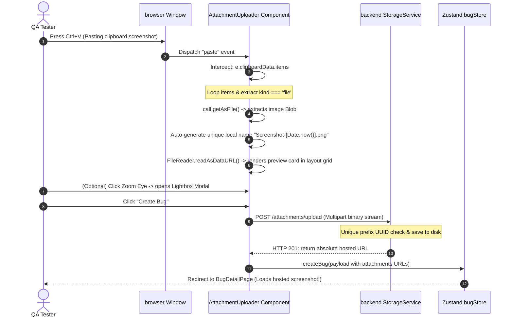
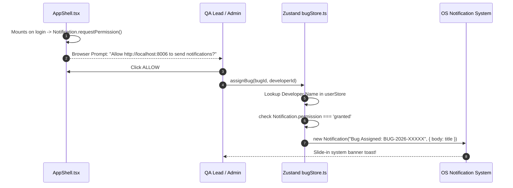

# 📐 Codebase Architecture & Data Pipelines — Software QA Tracker

This document provides a detailed architectural blueprint of the Software QA Platform's frontend-backend design, relational database models, and critical asynchronous pipelines (such as keyboard screenshot pasting and system notifications). It serves as a guide for engineering teams and AI coding agents looking to extend the codebase.

---

## 🎨 1. Tech Stack Overview

```
┌──────────────────────────────────────┐       ┌──────────────────────────────────────┐
│        React Frontend (Client)       │       │       FastAPI Backend (Server)       │
├──────────────────────────────────────┤       ├──────────────────────────────────────┤
│ Bundler: Vite 8                      │       │ API Engine: FastAPI (Python 3.10+)   │
│ UI Framework: React 18 (SPA)         │       │ Server: Uvicorn                      │
│ Styling: Vanilla CSS + Tailwind v3   │       │ ORM: SQLAlchemy v2.0                 │
│ Routing: React Router v6             │       │ Schema Validation: Pydantic v2       │
│ Icons: Lucide React                  │       │ Database: SQLite (dev) / Postgres    │
│ State: Zustand (Local/API)           │       │ Auth: OAuth2 JWT Token Bearer flow   │
└──────────────────────────────────────┘       └──────────────────────────────────────┘
```

---

## 💾 2. Relational Database ERD Schema

The backend relational schema maps all database tables. It supports fully structured JSON columns (`JSON` / `JSONB`) in SQLite and PostgreSQL, allowing for flexible properties like reproduction steps, tags, and QA verification logs.

```mermaid
erDiagram
    users ||--o{ bugs : "reported / assigned"
    projects ||--o{ bugs : "belongs to"
    bugs ||--o{ comments : "contains comments"
    bugs ||--o{ attachments : "has screenshots"
    bugs ||--o{ bug_history : "logs state edits"

    users {
        string id PK "UUID"
        string email UNIQUE "index"
        string password_hash "bcrypt"
        string name
        string role "tester/developer/admin"
        string color "hex"
        string initials "AS"
    }

    projects {
        string id PK "UUID"
        string name "index"
        string description
        string key UNIQUE "uppercase key"
        string icon "emoji icon"
        datetime created_at
    }

    bugs {
        string id PK "UUID"
        string bug_id UNIQUE "index (BUG-2026-00001)"
        string title
        string project_id FK
        string reported_by FK
        string assigned_to FK "nullable"
        string status "new/assigned/reopened/verified..."
        string severity "critical/high/medium..."
        string priority "p0/p1/p2..."
        string type "functional/security/database..."
        string environment "production/staging..."
        string platform "web/ios/android..."
        string affected_version
        string description
        json steps_to_reproduce "serialized list"
        string expected_result
        string actual_result
        string browser
        string os
        string app_version
        string url
        string operator_name
        string device_logs "stack trace"
        string branch_name
        string commit_id
        string pull_request_link
        string estimated_fix_time
        json tags "serialized list"
        json qa_verification "reopen/verify credentials"
        datetime created_at
        datetime updated_at
        datetime resolved_at
        datetime closed_at
    }

    comments {
        string id PK "UUID"
        string bug_id FK
        string user_id FK
        string text
        datetime timestamp
    }

    attachments {
        string id PK "UUID"
        string bug_id FK
        string name "file basename"
        integer size "bytes"
        string type "image/video/other"
        string url "absolute hosted URL"
        string uploaded_by FK
        datetime uploaded_at
        string mime_type "image/png"
    }

    bug_history {
        string id PK "UUID"
        string bug_id FK
        string field "changed property"
        string old_value
        string new_value
        string changed_by FK
        datetime timestamp
        string action "created/assigned/verified..."
        string description "human readable log"
    }
```

---

## 📎 3. Clipboard Screenshot Pasting Pipeline

The copy-paste uploader manages file extraction securely and efficiently. By mapping in-memory buffers directly via standard event listeners and references, it bypasses DOM exceptions across custom locales.



---

## 🌗 4. Dynamic Theme Switching Pipeline

The platform uses a CSS variable architecture supporting dynamic theming. Toggling the theme compiles variables instantly:

```mermaid
graph TD
    UIStore[Zustand uiStore.ts] -->|Toggles theme| State[State: 'light' | 'dark']
    State -->|Persists choice| LS[(localStorage)]
    State -->|AppShell mount sync| DOM[document.documentElement.classList]
    DOM -->|Toggle class| DarkClass{contains 'dark'?}
    DarkClass -->|Yes| DarkVars[Apply VS Code Dark Modern obsidian custom colors]
    DarkClass -->|No| LightVars[Apply Slate-White Creamy Custom Royal Blue colors]
```

---

## 🔔 5. Desktop Notifications Pipeline

Native HTML5 Web Notifications keep developers informed of reassigned tasks immediately:



---

## 📡 6. Frontend Stores API Migration Roadmap

If you are migrating the React stores from **`localStorage` (Zustand persist)** to our new **FastAPI server**, follow this mapping:

1. **`src/stores/bugStore.ts`**:
   * Change `createBug` to: `const res = await axios.post("/bugs", payload); set(s => ({ bugs: [res.data, ...s.bugs] }));`
   * Change `assignBug` to: `await axios.post(`/bugs/${id}/assign?assigneeId=${assigneeId}`);`
   * Change `verifyBug` to: `await axios.post(`/bugs/${id}/verify`, payload);`
   * Change `reopenBug` to: `await axios.post(`/bugs/${id}/reopen`, payload);`
2. **`src/stores/userStore.ts`**:
   * Bind login to `POST /auth/login`, save JWT token to cookie/localStorage, and fetch profile via `GET /auth/me`.
3. **`src/stores/projectStore.ts`**:
   * Change `fetchProjects` to call `GET /projects`.
